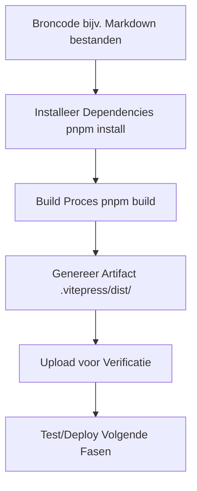

# Fase 2: Build - Geautomatiseerde Artifact Creatie

<div class="phase-card">
  <div class="phase-header">
    <span class="phase-title">🔨 Build Fase</span>
    <span class="workshop-status status-progress">In Uitvoering</span>
  </div>
  <p>Transformeer broncode naar deploybare artifacts met geautomatiseerde builds</p>
</div>

## Leerdoelen

Aan het einde van deze fase zul je:
- ✅ Begrijpen wat build artifacts zijn
- ✅ Een GitHub Actions workflow aanmaken voor geautomatiseerde builds
- ✅ pnpm gebruiken voor efficiënt dependency management
- ✅ Build outputs en artifacts verifiëren

## Theorie: Waarom de Build Fase Belangrijk Is

### Het Probleem Zonder Geautomatiseerde Builds
Zonder automatisering omvat het bouwen van een project handmatige stappen:
- 🚨 Handmatige dependency installatie op elke machine
- 🚨 Inconsistente builds over verschillende omgevingen
- 🚨 Geen manier om te verifiëren dat de build werkt voor deployment
- 🚨 Tijdrovend en foutgevoelig proces

### De DevOps Oplossing: Geautomatiseerde Builds

De Build fase ondersteunt **Automatisering** en **Lean** uit het CALMS framework:



### Kernconcepten

#### 1. Wat Zijn Build Artifacts?
Een build artifact is de officiële, verpakte output gegenereerd uit je broncode. Het is het \"ding\" dat je zult testen, releasen en deployen.
- **Broncode**: Mens-leesbare bestanden die je bewerkt (bijv. `docs/index.md`).
- **Build Proces**: Een geautomatiseerd script (`pnpm build`) transformeert die broncode.
- **Artifact**: Het resultaat is een zelfstandig, geoptimaliseerd pakket. In ons geval is het de `.vitepress/dist/` directory, met de definitieve HTML, CSS en JavaScript voor onze website.

**Waarom Artifacts?**: Broncode is voor developers. Artifacts zijn voor servers en gebruikers. Ze zijn consistent, veilig (geen broncode blootgesteld) en geoptimaliseerd voor prestaties.

#### 2. pnpm vs npm
- **pnpm**: Snellere, efficiëntere package manager (3x snellere installaties)
- **npm**: Traditionele package manager (langzamer, meer schijfgebruik)
- **Waarom pnpm?**: Gebruikt content-addressable storage en symlinks voor efficiëntie

#### 3. GitHub Actions voor Builds
GitHub Actions automatiseert het build proces:
- **Triggers**: Draait bij push naar main of pull requests
- **Omgeving**: Consistente Ubuntu runners
- **Caching**: Versnelt herhaalde builds met pnpm cache
- **Artifacts**: Upload build outputs voor download en verificatie

## Hands-On Oefening

<div class="tip-box">
  📋 <strong>Reference:</strong> Zie <code>.github/workflows/build.yml</code> voor de complete workflow.
</div>

### Stap 0: Enable GitHub actions

Voordat we kunnen beginnen met het maken van workflows, moeten workflows eerst op GitHub ingeschakeld staan.


### Stap 1: Creëer de Build Workflow

Maak het GitHub Actions workflow bestand om je build te automatiseren:

1. **Creëer de workflow directory en bestand**

   ```bash
   mkdir -p .github/workflows
   code .github/workflows/build.yml
   ```

2. **Voeg de build workflow content toe**

   ```yaml
   name: Build Phase
   on:
     push:
       branches: [ main ]
     pull_request:
       branches: [ main ]

   jobs:
     build:
       runs-on: ubuntu-latest
       steps:
         - name: Checkout code
           uses: actions/checkout@v4

         - name: Setup pnpm
           uses: pnpm/action-setup@v2
           with:
             version: 8

         - name: Setup Node.js
           uses: actions/setup-node@v4
           with:
             node-version: 18
             cache: 'pnpm'

         - name: Install dependencies
           run: pnpm install

         - name: Build the site
           run: pnpm build

         - name: Upload build artifact
           uses: actions/upload-artifact@v4
           with:
             name: workshop-site
             path: .vitepress/dist/
   ```

   **Waarom deze workflow?**
   - **Checkout**: Haalt je code op van GitHub
   - **pnpm setup**: Installeert pnpm voor snel dependency management
   - **Node setup**: Installeert Node.js met pnpm cache voor snelheid
   - **Install**: Gebruikt frozen lockfile voor consistente dependencies
   - **Build**: Draait `pnpm build` om de statische site te genereren
   - **Upload**: Slaat de gebouwde bestanden op als downloadbare artifacts

### Stap 2: Test de Build Lokaal

Voordat je naar GitHub pusht, test het build proces lokaal:

```bash
# Zorg ervoor dat je in de project root bent
cd devops-workshop-vitepress

# Installeer dependencies (indien niet al gedaan)
pnpm install

# Draai het build commando
pnpm build
```

**Verwachte output:**
```
vitepress v1.x.x
✓ building client + server bundles...
✓ rendering pages...
build complete in X.XXs.
```

**Verifieer de build artifact:**
```bash
# Controleer dat de dist directory bestaat
ls -la .vitepress/dist/

# Je zou moeten zien:
# - index.html
# - assets/ (CSS & JS)
# - setup.html, phases/, etc.
```

💡 <strong>Lokaal Testen Eerst:</strong> Test altijd lokaal voordat je pusht. Dit bespaart tijd en voorkomt onnodige CI runs.

### Stap 3: Commit en Push de Workflow

Nu de workflow klaar is, laten we het in versiebeheer plaatsen:

```bash
# Maak een nieuwe feature branch
git checkout -b feat/add-build-workflow

# Voeg de workflow toe
git add .github/workflows/ci.yml

# Commit met een beschrijvend bericht
git commit -m \"feat: voeg geautomatiseerde build workflow toe

- Configureert GitHub Actions voor CI/CD
- Installeert dependencies met pnpm
- Bouwt VitePress site
- Upload artifacts voor verificatie\"

# Push naar je fork
git push origin feat/add-build-workflow
```

### Stap 4: Creëer Pull Request en Monitor de Build

1. **Ga naar je repository op GitHub**
2. **Klik op \"Compare & pull request\"**
3. **Voeg een beschrijvende titel en omschrijving toe:**
   - **Titel**: `feat: voeg geautomatiseerde build workflow toe`
   - **Omschrijving**: Leg uit wat de workflow doet en waarom het belangrijk is

4. **Creëer de PR en monitor de Actions tab**
   - Het Actions tabblad toont je running workflow
   - Klik erop om de live logs te zien
   - Wacht tot alle checks groen zijn ✅

🎉 <strong>Eerste Geautomatiseerde Build!</strong> Je ziet nu je code automatisch bouwen in de cloud!

### Stap 5: Download en Verifieer het Artifact

Eenmaal de workflow voltooid is:

1. **Ga naar het Actions tabblad**
2. **Klik op je laatste workflow run**
3. **Scroll naar beneden naar \"Artifacts\"**
4. **Download `workshop-site.zip`**
5. **Pak het uit en open `index.html` in een browser**

**Jij zou je gebouwde website moeten zien!** Dit is precies wat later gedeployed zal worden.

💡 <strong>Artifact Verificatie:</strong> Het downloaden en inspecteren van artifacts helpt je begrijpen wat er precies gedeployed wordt.

## Validatie & Volgende Stappen

### ✅ Succescriteria

Je hebt de Build fase succesvol voltooid als:
- [x] Je GitHub Actions workflow draait succesvol
- [x] De build slaagt zonder errors
- [x] Je kunt het artifact downloaden
- [x] Het artifact bevat een werkende statische website
- [x] Je begrijpt waarom geautomatiseerde builds belangrijk zijn voor DevOps

### 🔍 Wat We Hebben Bereikt

**CALMS Framework Verbindingen:**
- **Automatisering**: Build proces draait automatisch bij elke push
- **Lean**: Consistente, herhaalbare builds zonder handmatig werk
- **Meting**: Kan zien of builds slagen of falen via Actions logs

**Technische Wins:**
- ✅ Consistente builds op elk platform (Ubuntu runner)
- ✅ Caching voor snellere builds
- ✅ Artifact opslag voor verificatie en deployment
- ✅ Zichtbaarheid in build status via GitHub UI

### 🚀 Volgende Fase

Nu je een werkend build proces hebt, is het tijd om **kwaliteitsborging** toe te voegen!

Ga verder naar Fase 3: Test

Denk na over hoe geautomatiseerde builds jouw development workflow verbeteren. Geen meer "het werkt op mijn machine" problemen—de build is consistent en betrouwbaar!
