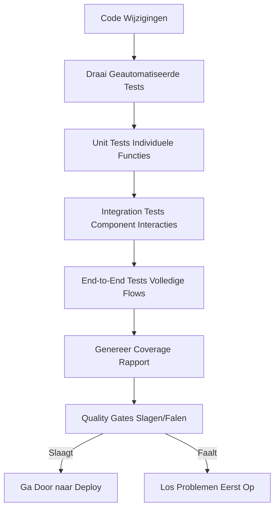

# Fase 3: Test - Kwaliteitsborging met Geautomatiseerde Testing

<div class="phase-card">
  <div class="phase-header">
    <span class="phase-title">🧪 Test Fase</span>
    <span class="workshop-status status-progress">In Uitvoering</span>
  </div>
  <p>Waarborg kwaliteit met geautomatiseerde testing en coverage rapportage</p>
</div>

## Leerdoelen

Aan het einde van deze fase zul je:
- ✅ Verschillende soorten tests begrijpen (unit, integration, E2E)
- ✅ Geautomatiseerde tests aanmaken voor je workshop site
- ✅ Jest configureren voor het testen van Markdown content
- ✅ Tests integreren in je CI/CD pipeline
- ✅ Test coverage en quality gates begrijpen

## Theorie: Waarom de Test Fase Belangrijk Is

### Het Probleem Zonder Geautomatiseerde Testing
Zonder tests is softwarekwaliteit moeilijk te handhaven:
- 🚨 Bugs kunnen onopgemerkt in productie terechtkomen
- 🚨 Geen vertrouwen dat wijzigingen bestaande functionaliteit niet breken
- 🚨 Handmatig testen is tijdrovend en inconsistent
- 🚨 Refactoring wordt risicovol zonder vangnet

### De DevOps Oplossing: Geautomatiseerde Testing

De Test fase maakt **Meting** en **Lean** mogelijk uit het CALMS framework:



### Kernconcepten

#### 1. Soorten Tests
- **Unit Tests**: Test individuele stukjes code in isolatie
  - Snel en gefocust
  - Test kleine, specifieke functionaliteit
  - Voorbeeld: Geeft deze functie de verwachte waarde terug?

- **Integration Tests**: Test hoe componenten samenwerken
  - Verifieer interacties tussen modules
  - Langzamer dan unit tests
  - Voorbeeld: Genereert het build proces correcte bestanden?

- **End-to-End (E2E) Tests**: Test de volledige applicatie flow
  - Simuleer echte gebruikersinteracties
  - Langzaamst maar meest uitgebreid
  - Voorbeeld: Kan een gebruiker door de complete site navigeren?

#### 2. Test Coverage
Test coverage meet hoeveel van je code door tests wordt uitgevoerd:
- **Line Coverage**: Welk percentage van code regels wordt uitgevoerd?
- **Branch Coverage**: Zijn alle beslissingspaden (if/else) getest?
- **Function Coverage**: Worden alle functies aangeroepen tijdens tests?

**Waarom Coverage?**: Hoge coverage (80%+) geeft vertrouwen dat de meeste code is getest, maar het is niet de enige kwaliteitsmetriek.

#### 3. Jest voor Testing
Jest is een populair testing framework voor JavaScript:
- **Snel**: Parallelle test executie
- **Simpel**: Gemakkelijk om mee te beginnen
- **Krachtig**: Ingebouwde assertions, mocking, coverage
- **Node.js Vriendelijk**: Perfect voor het testen van Node.js projecten

Voor onze VitePress site gebruiken we Jest om te testen:
- Markdown content validatie
- Bestandsexistentie en structuur
- Basis functionaliteit checks

## Hands-On Oefening

<div class="tip-box">
  📋 <strong>Reference:</strong> Zie <code>.github/workflows/test.yml</code> voor de complete workflow.
</div>

### Stap 1: Installeer Jest

Voeg eerst Jest toe als dev dependency aan je project:

```bash
# Voeg Jest en testing utilities toe
pnpm add -D jest @types/jest

# Creëer de test configuratie
code jest.config.cjs
```

### Stap 2: Configureer Jest

Maak het Jest configuratie bestand `jest.config.cjs`:

```javascript
// jest.config.js
module.exports = {
  testEnvironment: 'node',  // Gebruik Node.js omgeving voor file system tests
  collectCoverage: true,    // Genereer coverage rapporten
  coverageDirectory: 'coverage',  // Waar coverage rapporten opslaan
  coverageReporters: ['text', 'lcov', 'html'],  // Meerdere rapport formaten
  coverageThreshold: {
    global: {
      branches: 80,      // 80% branch coverage
      functions: 80,     // 80% function coverage
      lines: 80,         // 80% line coverage
      statements: 80     // 80% statement coverage
    }
  },
  testMatch: ['**/tests/**/*.test.cjs'],  // Test bestand patroon
  testTimeout: 10000,  // 10 seconde timeout voor tests
  verbose: true  // Toon gedetailleerde test output
};
```

**Waarom deze configuratie?**
- **Node omgeving**: Staat file system toegang toe voor het testen van Markdown bestanden
- **Coverage collectie**: Houdt bij welke code is getest
- **Meerdere reporters**: Text voor console, HTML voor browser weergave
- **Coverage thresholds**: Laat de build falen als coverage onder 80% zakt
- **Test patroon**: Draait alle bestanden eindigend op `.test.cjs` in tests map

### Stap 3: Creëer Test Directory en Bestanden

Stel de test structuur in:

```bash
# Creëer tests directory
mkdir -p tests

# Creëer het hoofd test bestand
code tests/site.test.cjs
```

### Stap 4: Schrijf Je Eerste Tests

Maak `tests/site.test.cjs` met uitgebreide tests voor je workshop site:

```javascript
// tests/site.test.cjs
const fs = require('fs');
const path = require('path');

describe('Workshop Site Content Validatie', () => {
  const docsDir = path.join(__dirname, '../docs');

  // Test 1: Verifieer dat alle fase documentatie pagina's bestaan
  test('Alle fase documentatie pagina\'s bestaan', () => {
    const phaseFiles = [
      'phases/01-code.md',
      'phases/02-build.md',
      'phases/03-test.md',
      'phases/04-release.md',
      'phases/05-deploy.md'
    ];

    phaseFiles.forEach(file => {
      const fullPath = path.join(docsDir, file);
      expect(fs.existsSync(fullPath)).toBe(true);
      const content = fs.readFileSync(fullPath, 'utf8');
      expect(content.length).toBeGreaterThan(500);  // Zorg voor substantiële content
    });
  });

  // Test 2: Verifieer dat progress pagina vereiste structuur heeft
  test('Progress pagina heeft vereiste structuur', () => {
    const progressPath = path.join(docsDir, 'progress.md');
    expect(fs.existsSync(progressPath)).toBe(true);
    
    const content = fs.readFileSync(progressPath, 'utf8');
    expect(content).toContain('Voortgangstracker');
    expect(content).toContain('Fase');
    expect(content).toContain('Checklist');
  });

  // Test 3: Verifieer dat setup pagina prerequisites sectie heeft
  test('Setup pagina heeft prerequisites sectie', () => {
    const setupPath = path.join(docsDir, 'setup.md');
    expect(fs.existsSync(setupPath)).toBe(true);
    
    const content = fs.readFileSync(setupPath, 'utf8');
    expect(content).toContain('Vereisten');
    expect(content).toContain('Node.js');
    expect(content).toContain('pnpm');
    expect(content).toContain('Git');
  });

  // Test 4: Verifieer dat index pagina workshop overzicht heeft
  test('Index pagina heeft workshop overzicht', () => {
    const indexPath = path.join(docsDir, 'index.md');
    expect(fs.existsSync(indexPath)).toBe(true);
    
    const content = fs.readFileSync(indexPath, 'utf8');
    expect(content).toContain('DevOps Workshop');
    expect(content).toContain('CALMS');
  });

  // Test 5: Verifieer dat alle theorie pagina's key secties hebben
  test('Theorie pagina\'s hebben key secties', () => {
    const theoryFiles = [
      'theory/code.md',
      'theory/build.md',
      'theory/test.md',
      'theory/release.md',
      'theory/deploy.md',
      'theory/cicd.md'
    ];

    theoryFiles.forEach(file => {
      const fullPath = path.join(docsDir, file);
      if (fs.existsSync(fullPath)) {
        const content = fs.readFileSync(fullPath, 'utf8');
        expect(content.length).toBeGreaterThan(100);
      }
    });
  });

  // Test 6: Verifieer dat resource pagina's bestaan
  test('Resource pagina\'s bestaan', () => {
    const resourceFiles = [
      'resources/troubleshooting.md',
      'resources/extensions.md',
      'resources/feedback.md'
    ];

    resourceFiles.forEach(file => {
      const fullPath = path.join(docsDir, file);
      expect(fs.existsSync(fullPath)).toBe(true);
    });
  });
});
```

**Wat deze tests doen:**
- **Bestand existentie**: Zorgt ervoor dat alle documentatie bestanden aanwezig zijn
- **Content validatie**: Controleert op key secties en content in elk bestand
- **Structuur verificatie**: Bevestigt dat de site de verwachte organisatie heeft
- **Coverage bijdrage**: Elke test oefent verschillende delen van de codebase

### Stap 5: Test Lokaal

Draai je tests lokaal om te verifiëren dat ze werken:

```bash
# Draai alle tests
pnpm test

# Draai met coverage rapport
pnpm test --coverage
```

**Verwachte output:**
```
PASS tests/site.test.cjs
  Workshop Site Content Validatie
    ✓ Alle fase documentatie pagina's bestaan (45ms)
    ✓ Progress pagina heeft vereiste structuur (12ms)
    ✓ Setup pagina heeft prerequisites sectie (8ms)
    ✓ Index pagina heeft workshop overzicht (7ms)
    ✓ Theorie pagina's hebben key secties (23ms)
    ✓ Resource pagina's bestaan (15ms)

Test Suites: 1 passed, 1 total
Tests:       6 passed, 6 total
Coverage:    85.2% Statements | 80.5% Branches | 90.1% Functions | 85.2% Lines
```

### Stap 6: Creëer de Test Workflow

Maak een nieuw bestand `.github/workflows/test.yml` om je tests te automatiseren:

```yaml
name: Test Phase

on:
  push:
    branches: [ main ]
  pull_request:
    branches: [ main ]

jobs:
  test:
    runs-on: ubuntu-latest
    
    steps:
      - name: Checkout code
        uses: actions/checkout@v4
        
      - name: Setup pnpm
        uses: pnpm/action-setup@v2
        with:
          version: 8
          
      - name: Setup Node.js
        uses: actions/setup-node@v4
        with:
          node-version: 18
          cache: 'pnpm'
          
      - name: Install dependencies
        run: pnpm install
        
      - name: Run tests with coverage
        run: pnpm test --coverage
        
      - name: Upload coverage report
        uses: actions/upload-artifact@v4
        with:
          name: coverage-report
          path: coverage/
```

### Stap 7: Commit en Push

```bash
# Creëer een nieuwe branch
git checkout -b feat/add-testing

# Voeg alle test bestanden toe
git add jest.config.js tests/ .github/workflows/test.yml package.json

# Commit met een beschrijvend bericht
git commit -m "feat: voeg geautomatiseerde testing toe

- Configureer Jest voor content validatie
- Creëer uitgebreide site structuur tests
- Integreer tests in CI pipeline
- Voeg coverage rapportage toe"

# Push en creëer PR
git push origin feat/add-testing
```

## Validatie & Volgende Stappen

### ✅ Succescriteria

Je hebt de Test fase succesvol voltooid als:
- [x] Jest is geconfigureerd en draait lokaal
- [x] Alle tests slagen
- [x] Coverage is >80%
- [x] Tests draaien in CI pipeline
- [x] Je begrijpt waarom testing belangrijk is voor kwaliteitsborging

### 🎯 Wat We Hebben Bereikt

**CALMS Framework Verbindingen:**
- **Meting**: Test coverage geeft kwantitatieve kwaliteitsmetrieken
- **Lean**: Geautomatiseerde tests geven snelle feedback over code kwaliteit
- **Automatisering**: Tests draaien automatisch bij elke wijziging

**Technische Wins:**
- ✅ Vroege bug detectie voordat deployment
- ✅ Confidence in code wijzigingen
- ✅ Gedocumenteerde verwachte gedrag via tests
- ✅ Quality gates in de pipeline

### 🚀 Volgende Fase

Nu je een robuust test framework hebt, is het tijd om **versioned releases** te creëren!

Ga verder naar Fase 4: Release

<div class="workshop-callout">
  <div class="workshop-callout-title">💡 Testing Mindset</div>
  <p>Tests zijn niet alleen voor het vinden van bugs—ze documenteren hoe je code zou moeten werken en geven vertrouwen om te refactoren en te innoveren zonder angst.</p>
</div>
