# Fase 4: Release - Versiebeheer

<div class="phase-card">
  <div class="phase-header">
    <span class="phase-title">🏷️ Release Fase</span>
    <span class="phase-title-status status-progress">In Uitvoering</span>
  </div>
  <p>Creëer versioned releases met semantic versioning en downloadbare artifacts</p>
</div>

## Leerdoelen

Aan het einde van deze fase zul je:
- ✅ Semantic versioning (SemVer) begrijpen
- ✅ Geautomatiseerde releases aanmaken getriggerd door Git tags
- ✅ Release notes en downloadbare assets genereren
- ✅ Het verschil begrijpen tussen releases en deployments
- ✅ Je voortgangstracker updaten met release prestaties

## Theorie: Waarom de Release Fase Belangrijk Is

### Het Probleem Zonder Goede Releases
Zonder gestructureerde releases wordt softwaredistributie chaotisch:
- 🚨 Geen duidelijke versioning strategie leidt tot verwarring
- 🚨 Moeilijk om bij te houden welke wijzigingen in elke versie zitten
- 🚨 Geen manier om stabiele snapshots te distribueren
- 🚨 Lastig om terug te rollen naar vorige versies

### De DevOps Oplossing: Geautomatiseerde Releases

De Release fase ondersteunt **Lean** en **Delen** uit het CALMS framework:

```mermaid
graph TD
  A[Code Wijzigingen] --> B[Creëer Git Tag]
  B --> C[Trigger Release Workflow]
  C --> D[Bouw Artifacts]
  D --> E[Genereer Release Notes]
  E --> F[Creëer GitHub Release]
  F --> G[Upload Assets]
  G --> H[Deel met Team]
```



### Kernconcepten

#### 1. Semantic Versioning (SemVer)
Versienummers volgen het patroon: `MAJOR.MINOR.PATCH`

- **MAJOR**: Breaking changes (1.0.0 → 2.0.0)
- **MINOR**: Nieuwe features, backward compatible (1.0.0 → 1.1.0)
- **PATCH**: Bug fixes, backward compatible (1.0.0 → 1.0.1)

**Voorbeelden:**
- `v1.0.0` → Eerste stabiele release
- `v1.1.0` → Nieuwe feature toegevoegd
- `v1.1.1` → Bug fix in v1.1.0
- `v2.0.0` → Breaking change, niet backward compatible

#### 2. Releases vs. Deployments
- **Release**: Creëert een versioned snapshot met assets (ZIP, changelogs)
- **Deployment**: Publiceert de laatste code naar productie (live site)
- **Waarom beide?**: Releases bieden stabiele distributiepunten; deployments houden de site actueel

**Analogie:** Een release is als een boek uitgeven (versie 1.0), deployment is als je website updaten met nieuwe content.

## Hands-On Oefening

<div class="tip-box">
  📋 <strong>Reference:</strong> Zie <code>.github/workflows/release.yml</code> voor de complete workflow.
</div>

### Stap 1: Creëer de Release Workflow

Maak een nieuw bestand `.github/workflows/release.yml` om release automatisering toe te voegen:

```yaml
name: Release Phase

on:
  push:
    tags:
      - 'v*'

jobs:
  release:
    runs-on: ubuntu-latest
    permissions:
      contents: write
    steps:
      - name: Checkout code
        uses: actions/checkout@v4
        
      - name: Setup pnpm
        uses: pnpm/action-setup@v2
        with:
          version: 8
          
      - name: Setup Node.js
        uses: actions/setup-node@v4
        with:
          node-version: 18
          cache: 'pnpm'
          
      - name: Install dependencies
        run: pnpm install
        
      - name: Build for release
        run: pnpm build
        
      - name: Create release archive
        run: |
          zip -r workshop-site-${{ github.ref_name }}.zip .vitepress/dist/
          
      - name: Create GitHub Release
        uses: softprops/action-gh-release@v1
        with:
          files: workshop-site-${{ github.ref_name }}.zip
          generate_release_notes: true
          name: DevOps Workshop ${{ github.ref_name }}
```

**Wat doet deze workflow?**
- **Trigger**: Draait alleen wanneer een tag beginnend met 'v' wordt gepusht
- **Dependencies**: Wacht tot build en test jobs slagen
- **Archive**: Creëert een ZIP van de gebouwde site
- **Release**: Maakt automatisch een GitHub release met notes

### Stap 2: Test Lokaal en Commit

```bash
# Creëer een nieuwe branch voor release functionaliteit
git checkout -b feat/add-releases

# Test build lokaal
pnpm build

# Commit de workflow wijzigingen
git add .github/workflows/ci.yml
git commit -m "feat: voeg geautomatiseerde release workflow toe

- Trigger releases bij versie tags
- Genereer downloadbare site archives
- Auto-creëer GitHub releases met notes"

# Push en merge via PR
git push origin feat/add-releases
```

### Stap 3: Creëer Je Eerste Release

Nu je eerste versie tag aanmaken om een release te triggeren:

```bash
# Schakel naar main branch en pull laatste wijzigingen
git checkout main
git pull origin main

# Creëer en push een versie tag
git tag v1.0.0
git push origin v1.0.0
```

**Wat gebeurt er nu?**
1. GitHub detecteert de nieuwe tag
2. Release workflow wordt automatisch getriggerd
3. Site wordt gebouwd en in ZIP verpakt
4. GitHub release wordt aangemaakt met downloadbare assets

### Stap 4: Verifieer Je Release

1. **Ga naar GitHub Actions** en bekijk de release workflow run
2. **Bezoek je repository's Releases tab**
3. **Download het gegenereerde ZIP bestand**
4. **Pak uit en verifieer** dat het je gebouwde site bevat

<div class="success-box">
🎉 <strong>Je Eerste Release!</strong> Je hebt nu een professionele, downloadbare distributie van je workshop site!
</div>

### Stap 5: Update Je Voortgangstracker

Bewerk je `docs/progress.md` om Fase 4 als compleet te markeren:

```markdown
### Fase 4: Release - Versiebeheer 🏷️

**Voltooiing Checklist:**
- [x] Release job toegevoegd aan CI workflow (getriggerd door tags)
- [x] Mijn eerste tag aangemaakt en gepusht (`v1.0.0`)
- [x] Een release gegenereerd met downloadbare assets
- [x] Release ZIP bestand gedownload en geverifieerd
- [x] Het verschil begrepen tussen releases en deployments

**Mijn Release Fase Notities:**

Release management brengt structuur naar softwaredistributie!
- Semantic versioning biedt duidelijke change communicatie
- Geautomatiseerde releases elimineren handmatige packaging fouten
- ZIP archives maken offline distributie en backup mogelijk
- GitHub releases creëren een professionele distributie ervaring


**Tijdstempel Voltooid:** [Huidige datum/tijd]
```

## Validatie & Volgende Stappen

### ✅ Succescriteria

**Fase 4 Compleet** wanneer je hebt:
- [x] Geautomatiseerde release workflow getriggerd door tags
- [x] Succesvol v1.0.0 release aangemaakt
- [x] Release assets gedownload en geverifieerd
- [x] Voortgangstracker bijgewerkt met voltooiing

### 💡 Release Best Practices

<div class="tip-box">
<strong>Wanneer Taggen?</strong>
<ul>
<li><strong>Tag doordacht:</strong> Niet elke commit taggen—reserveer voor milestone versies</li>
<li><strong>Genereer notes:</strong> Auto-gegenereerde release notes helpen gebruikers wijzigingen begrijpen</li>
<li><strong>Voeg assets toe:</strong> ZIP bestanden maken offline distributie en archivering mogelijk</li>
<li><strong>Semantic versioning:</strong> Helpt gebruikers de impact van updates begrijpen</li>
</ul>
</div>

### Wanneer Releasen vs. Deployen

- **Release** (v1.0.0): Voor milestones, grote features, of distributiebehoeften
- **Deploy**: Elke merge naar main voor continue gebruikerswaarde

Deze dubbele aanpak maakt zowel **continuous delivery** als **stabiele distributie** mogelijk.

### 🎯 Wat We Hebben Bereikt

**CALMS Framework Verbindingen:**
- **Lean**: Gestroomlijnde distributie zonder handmatig werk
- **Delen**: Professionele manier om software te delen met stakeholders
- **Meting**: Versienummers maken progress tracking mogelijk

**Praktische Voordelen:**
- ✅ Duidelijke versiegeschiedenis
- ✅ Downloadbare snapshots voor offline gebruik
- ✅ Professionele distributie voor stakeholders
- ✅ Rollback mogelijkheden naar eerdere versies

### 🚀 Volgende Fase

Nu je releases hebt, is het tijd voor de finale stap: **automatische deployment naar productie**!

Ga verder naar Fase 5: Deploy

<div class="workshop-callout">
  <div class="workshop-callout-title">🏷️ Release Strategie</div>
  <p>Releases zijn je "officiële" versies—gebruik ze voor belangrijke milestones. Deployment is je "live" site—update het vaak. Samen geven ze je zowel stabiliteit als snelheid!</p>
</div>
