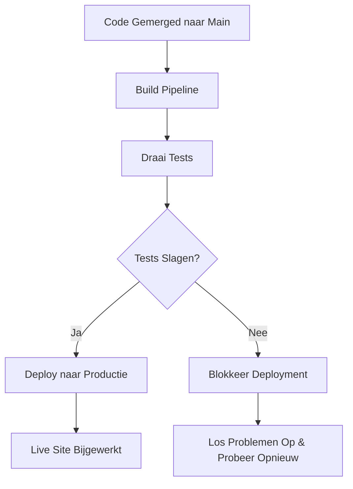

# Fase 5: Deploy - Productie Automatisering

<div class="phase-card">
  <div class="phase-header">
    <span class="phase-title">🚀 Deploy Fase</span>
    <span class="workshop-status status-progress">Finale Fase</span>
  </div>
  <p>Automatisch deployen naar productie met GitHub Pages</p>
</div>

## Leerdoelen

Aan het einde van deze fase zul je:
- ✅ Automatische deployment naar GitHub Pages implementeren
- ✅ Continuous deployment principes begrijpen
- ✅ De complete CI/CD pipeline ervaren
- ✅ Je DevOps workshop reis voltooien
- ✅ Je voortgangstracker finaliseren als een DevOps prestatie

## Theorie: Waarom de Deploy Fase Belangrijk Is

### Het Probleem Zonder Geautomatiseerde Deployment
Handmatige deployment processen zijn foutgevoelig en traag:
- 🚨 Handmatige stappen leiden tot inconsistente deployments
- 🚨 Deployment wordt een bottleneck in het ontwikkelproces
- 🚨 Risico op menselijke fouten in productie releases
- 🚨 Geen automatische rollback mogelijkheden

### De DevOps Oplossing: Continuous Deployment

De Deploy fase belichaamt **Automatisering** en **Lean** uit het CALMS framework:



### Kernconcepten

#### 1. Continuous Deployment vs Continuous Delivery
- **Continuous Delivery**: Code is altijd klaar om te deployen (handmatige trigger)
- **Continuous Deployment**: Code wordt automatisch gedeployed bij elke merge naar main
- **Deze Workshop**: We implementeren Continuous Deployment!

#### 2. GitHub Pages
- **Gratis hosting**: Voor statische websites direct vanuit je repository
- **Automatisch HTTPS**: Veilige verbindingen out-of-the-box
- **Custom domains**: Optioneel je eigen domeinnaam gebruiken
- **Perfect voor VitePress**: Geoptimaliseerd voor statische sites

## Hands-On Oefening: Voltooi Je CI/CD Pipeline

<div class="tip-box">
  📋 <strong>Reference:</strong> Zie <code>.github/workflows/deploy.yml</code> voor de complete workflow.
</div>

### Stap 1: Creëer de Deploy Workflow

Maak een nieuw bestand `.github/workflows/deploy.yml`:

```yaml
name: Deploy VitePress site to Pages

on:
  push:
    branches: [main]
  workflow_dispatch:

permissions:
  contents: read
  pages: write
  id-token: write

concurrency:
  group: pages
  cancel-in-progress: false

jobs:
  build:
    runs-on: ubuntu-latest
    steps:
      - name: Checkout
        uses: actions/checkout@v4
        with:
          fetch-depth: 0

      - name: Setup Node
        uses: actions/setup-node@v4
        with:
          node-version: 18
          cache: 'pnpm'
          cache-dependency-path: package.json

      - name: Setup Pages
        uses: actions/configure-pages@v4

      - name: Install dependencies with pnpm and build
        run: |
          pnpm install
          pnpm build
      - name: Upload artifact
        uses: actions/upload-pages-artifact@v3
        with:
          path: .vitepress/dist

  deploy:
    environment:
      name: github-pages
      url: ${{ steps.deployment.outputs.page_url }}
    needs: build
    runs-on: ubuntu-latest
    name: Deploy
    steps:
      - name: Deploy to GitHub Pages
        id: deployment
        uses: actions/deploy-pages@v4
```

**Wat doet deze workflow?**
- **Trigger**: Draait alleen bij pushes naar main branch
- **Dependencies**: Wacht tot build en test slagen
- **Permissions**: Geeft write toegang voor deployment
- **Deploy**: Pusht gebouwde site naar gh-pages branch

### Stap 2: Test de Volledige Pipeline

Voordat we de website kunnen zien, moet GitHub Pages eerst zijn geconfigureerd om te deployen via GitHub Actions.


Laten we je complete CI/CD pipeline testen:

```bash
# Creëer een branch voor finale updates
git checkout -b feat/complete-pipeline

# Voeg de deploy job toe
git add .github/workflows/ci.yml

# Update je voortgangstracker om voltooiing te tonen
# Bewerk docs/progress.md en markeer Fase 5 als compleet

# Commit alle wijzigingen
git commit -m "feat: voltooi CI/CD pipeline met deployment

- Voeg geautomatiseerde deployment toe naar GitHub Pages
- Update voortgangstracker met Fase 5 voltooiing
- Klaar voor volledige pipeline test"

# Push en creëer PR
git push origin feat/complete-pipeline
```

### Stap 3: Merge en Bekijk de Magie

1. **Creëer en merge je PR** naar main
2. **Bekijk GitHub Actions** de complete pipeline draaien:
   - Build ✅
   - Test ✅
   - Deploy ✅
3. **Bezoek je live site**: `https://[jouw-gebruikersnaam].github.io/devops-workshop-vitepress/`

<div class="success-box">
🎉 <strong>DevOps Magisch Moment:</strong> Je wijzigingen zijn nu automatisch live! Elke toekomstige edit naar main zal automatisch bouwen, testen en deployen.
</div>

### Stap 4: Vier en Documenteer Je Prestatie

Update je voortgangstracker een laatste keer:

```markdown
### Fase 5: Deploy - Productie Automatisering 🚀

**Voltooiing Checklist:**
- [x] Deploy job toegevoegd aan CI workflow
- [x] Succesvol site gedeployed naar GitHub Pages
- [x] Live site geverifieerd op: https://[mijn-gebruikersnaam].github.io/devops-workshop-vitepress/
- [x] Een wijziging gemaakt en het automatisch zien deployen
- [x] De volledige CI/CD pipeline voltooid van code tot productie

**Mijn Deploy Fase Notities:**
De complete DevOps transformatie!
- Geautomatiseerde deployment elimineert handmatige fouten
- Continuous delivery biedt onmiddellijke gebruikerswaarde
- De volledige pipeline geeft vertrouwen in elke wijziging
- DevOps transformeert hoe we software leveren

**Tijdstempel Voltooid:** [Huidige datum/tijd]
```

## Eindreflectie Workshop

### Algemene Leersamenvatting
```
1. Grootste DevOps inzicht dat ik heb verkregen:
   De kracht van automatisering om handmatig werk te elimineren en snellere, 
   betrouwbaardere levering mogelijk te maken

2. Meest uitdagende deel van de workshop:
   [Jouw ervaring - misschien Git workflows begrijpen of pipeline issues debuggen]

3. Hoe dit mijn aanpak van softwareontwikkeling verandert:
   Ik zie nu de waarde van tijd investeren in automatisering om later tijd te besparen

4. Wat ik wil implementeren op het werk/in persoonlijke projecten:
   Geautomatiseerde testing en deployment pipelines voor al mijn projecten

5. Beoordeling (1-10) en waarom:
   9/10 - Hands-on aanpak maakte DevOps concepten concreet en actionable
```

## Complete CI/CD Pipeline Prestatie 🏆

**Definitieve Site URL:** `https://[jouw-gebruikersnaam].github.io/devops-workshop-vitepress/`  
**Repository URL:** `https://github.com/[jouw-gebruikersnaam]/devops-workshop-vitepress`  
**Voltooiingsdatum:** [Vandaag's datum]

## Wat Je Hebt Bereikt

<div class="timeline">
  <div class="timeline-item">
    <h3>✅ Code Fase</h3>
    <p>Git workflows, branching en Pull Requests gemeesterd</p>
  </div>
  <div class="timeline-item">
    <h3>✅ Build Fase</h3>
    <p>Artifact creatie geautomatiseerd met GitHub Actions</p>
  </div>
  <div class="timeline-item">
    <h3>✅ Test Fase</h3>
    <p>Quality gates geïmplementeerd met geautomatiseerde testing</p>
  </div>
  <div class="timeline-item">
    <h3>✅ Release Fase</h3>
    <p>Versioned distributies aangemaakt met semantic versioning</p>
  </div>
  <div class="timeline-item">
    <h3>✅ Deploy Fase</h3>
    <p>Continuous deployment naar productie bereikt</p>
  </div>
</div>

## Jouw DevOps Transformatie

Je hebt het complete **CALMS** framework ervaren:

- **Cultuur**: Collaboratieve ontwikkeling via PRs en code review
- **Automatisering**: Volledige pipeline van code commit tot productie deployment
- **Lean**: Handmatig deployment werk geëlimineerd en feedback versneld
- **Meting**: Test coverage metrieken en pipeline success tracking
- **Delen**: Documentatie en kennisoverdracht via je voortgangstracker

## Volgende Stappen: Ga Verder Met Je DevOps Reis

<div class="phase-card">
  <div class="phase-header">
    <span class="phase-title">🚀 Voorbij de Workshop</span>
    <span class="workshop-status status-complete">Klaar om te Schalen</span>
  </div>
  <p>Breng je nieuwe DevOps vaardigheden naar het volgende niveau</p>
</div>

1. **Verken Uitbreidingen** - Voeg geavanceerde features toe aan je pipeline
2. **Deel Je Prestatie** - Voeg je site URL toe aan de workshop chat
3. **Geef Feedback** - Help deze workshop te verbeteren voor anderen
4. **Pas Toe op Echte Projecten** - Implementeer CI/CD in je werk of persoonlijke projecten

### 🎓 Geavanceerde DevOps Topics om Te Verkennen

- **Monitoring & Observability**: Voeg logging en metrics toe
- **Infrastructure as Code**: Terraform, Ansible
- **Container Orchestration**: Docker, Kubernetes
- **Security Scanning**: SAST, DAST, dependency scanning
- **Multi-environment Deployments**: Staging, production
- **Feature Flags**: Gradual rollouts en A/B testing

<div class="workshop-callout">
  <div class="workshop-callout-title">🎓 DevOps Gecertificeerd!</div>
  <p>Je hebt een volledige DevOps transformatie reis voltooid. Je begrijpt niet alleen de tools, maar ook de cultuur en praktijken die DevOps succesvol maken. Je live site en geautomatiseerde pipeline zijn bewijs van je nieuwe capaciteiten!</p>
</div>

**Gefeliciteerd! Je bent nu een DevOps practitioner met real-world ervaring.**

---

## 💡 Belangrijkste Leerpunten

### De DevOps Mindset
- **Automatiseer Alles**: Als je het meer dan twee keer doet, automatiseer het
- **Fail Fast**: Vroege feedback is goedkoper dan late bugs
- **Continuous Improvement**: DevOps is een reis, geen bestemming
- **Collaboration Over Silos**: Dev en Ops werken samen, niet apart

### Technische Vaardigheden Verworven
- ✅ Git workflows en branching strategieën
- ✅ GitHub Actions CI/CD pipelines
- ✅ Geautomatiseerde testing met Jest
- ✅ Semantic versioning en release management
- ✅ Continuous deployment naar productie
- ✅ Infrastructure automation (GitHub Pages)

### Soft Skills Ontwikkeld
- ✅ Code review en collaboration
- ✅ Documentatie en kennisdeling
- ✅ Problem-solving en debugging
- ✅ Process thinking en optimization

---

*Je DevOps reis gaat door. Blijf bouwen, blijf automatiseren, blijf verbeteren!*

**🚀 Succes met je toekomstige DevOps avonturen!**
