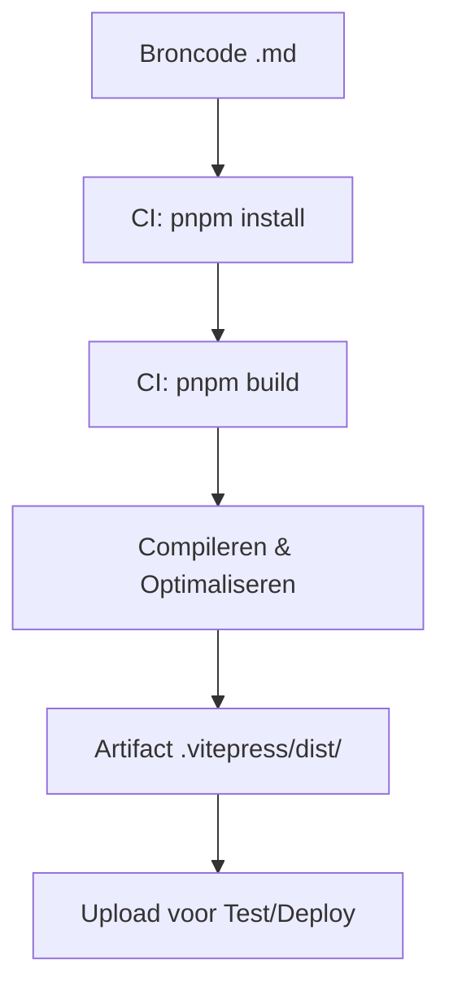

# Build Fase Theorie

## Wat is de Build Fase?

De **Build Fase** transformeert mens-leesbare broncode (uit de Code fase) naar machine-klare **artifacts**.

In deze workshop:
- **Input**: Markdown bestanden (`.md`), configuratie, afbeeldingen
- **Proces**: VitePress compiler (draait via Node.js)
- **Output**: Statische HTML/CSS/JS bestanden in `.vitepress/dist/`

**Doel**: Creëer een consistent, deploybaar pakket dat onafhankelijk is van de omgeving van de ontwikkelaar.

**CALMS Verbinding**:
- **Automatisering**: Scripts bouwen de site
- **Lean**: Elimineert handmatige compilatie stappen

## Waarom Builden?

Waarom niet gewoon de broncode deployen?
1. **Prestaties**: Builds optimaliseren assets (minificatie, compressie)
2. **Consistentie**: Een build werkt overal hetzelfde (geen "werkt op mijn machine")
3. **Validatie**: Het build proces vangt syntax fouten en gebroken referenties

**Analogie**:
- **Code**: Het recept en de ingrediënten
- **Build**: Het koken van de maaltijd
- **Artifact**: Het geserveerde gerecht (klaar voor consumptie)

## Kernconcepten

### 1. Artifacts
Een **artifact** is de onveranderlijke output van een build.
- **Eigenschappen**: Versioned, zelfstandig, deploybaar
- **In onze workshop**: De `.vitepress/dist/` map (gezipt voor releases)

**Waarom belangrijk?** We testen en deployen *het artifact*, niet de broncode. Dit garandeert dat wat we testen exact hetzelfde is als wat live gaat.

### 2. Dependency Management
- **pnpm**: Onze package manager
- **Lockfile** (`pnpm-lock.yaml`): Garandeert exacte versies van dependencies
- **CI Install**: `pnpm install` (strikt, geen updates toegestaan)

**Waarom frozen lockfile?** Voorkomt dat builds breken omdat een dependency stiekem is geüpdatet.

### 3. Build Automatisering
GitHub Actions voert de build uit in een schone omgeving (Ubuntu container).
- **Stappen**: Checkout → Setup Node/pnpm → Install → Build → Upload Artifact

### 4. Caching
Dependencies downloaden kost tijd. Caching bewaart ze tussen builds om tijd te besparen (Lean).

## DevOps Maturity

- **Level 1**: Handmatig bouwen en uploaden via FTP
- **Level 2**: Build scripts lokaal draaien
- **Level 3**: Geautomatiseerde CI builds (workshop doel)
- **Level 4**: Geoptimaliseerde builds met caching en parallelisatie

## Visualisatie

## Q&A

**V: Waarom bouwen we bij elke push?**
A: Om direct te weten of onze wijzigingen de build breken (Continuous Integration).

**V: Wat als de build faalt?**
A: De pipeline stopt direct. Geen kapotte code naar productie (Lean/Quality Gate).

## Hands-On
Ga naar Hands-on: Code & Build om je build pipeline te maken!

**Reflectie**: We hebben nu een artifact. Maar werkt het ook zoals bedoeld? Volgende stap: **Testen**.
